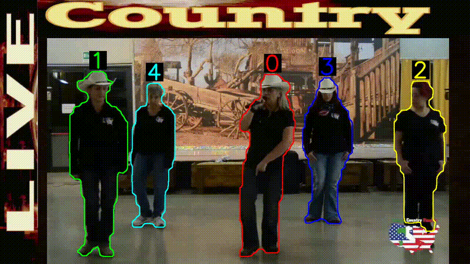
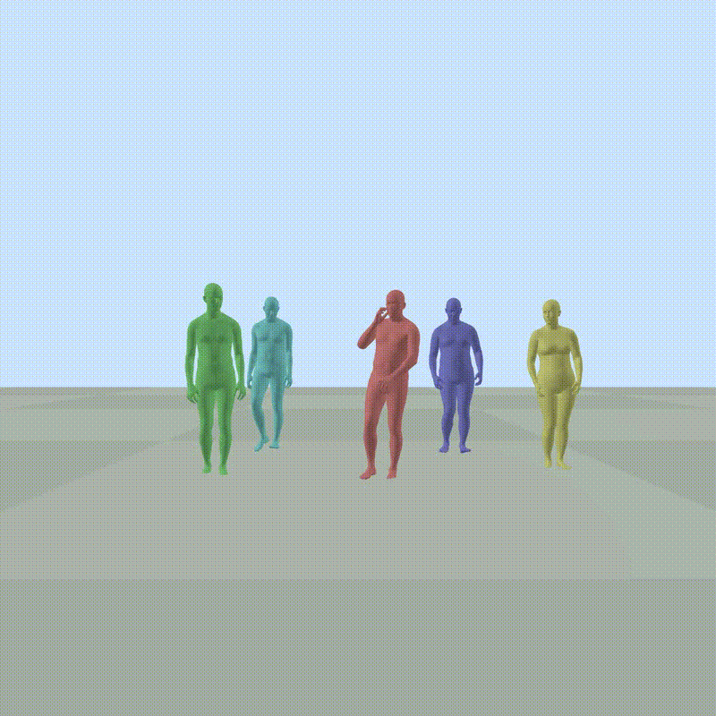

# XmoPipe

Multi-stage motion capture pipeline from YouTube videos, producing a dataset in HumanML3D format (263D).

---

## Quick start

### All parameters are centralized in [`config.yml`](config.yml) at the root of the repo. Edit it before running anything.

Run the steps in the following order. Steps 3 and 4 are independent and can run in parallel across multiple machines - each script uses a file-based locking system (`video_verif.py`) to avoid conflicts.

```bash
cd 1-Download        && ./download.sh
cd 2-Filter          && ./filter.sh
cd 3-Body            && ./body.sh       # can run in parallel with step 4 on a separate machine
cd 4-Face            && ./face.sh       # can run in parallel with step 3 on a separate machine
cd 5-Merge           && ./mergePP.sh    # needs steps 3 and 4 to be complete
cd 6-Captions        && ./caption.sh    # needs step 5
cd 6b-Captions_augm  && ./caption.sh    # needs step 6
# Step 7: open 7-Conversion_263/raw_pose_processing.ipynb and run cells in order (needs steps 5 and 6)
```

---

## Installation

### Tested on

| Component | Version |
|---|---|
| OS | Ubuntu 24.04.4 LTS |
| Kernel | Linux 6.17.0-19-generic |
| GPU | NVIDIA RTX 2000 Ada Generation 8 GB |
| CPU | Intel Core Ultra 7 165H |
| CUDA | 12.1 |

### Prerequisites
- [Anaconda](https://www.anaconda.com/download) or Miniconda
- NVIDIA GPU with CUDA 12.1
- FFmpeg (`sudo apt install ffmpeg`)
- [Ollama](https://ollama.com/) for the optional step 1 query generation (`YTPromptIdeas.py`)

### Quick install

```bash
git clone <repo-url>
cd xmopipe
bash setup.sh      # creates xmo-3d and xmo-llm conda environments (~30 min)
bash download.sh   # downloads all model checkpoints (~10 GB)
```

`setup.sh` creates two environments:
- `xmo-3d` — steps 1–5 (Python 3.10, torch 2.3.0+cu121, pytorch3d)
- `xmo-llm` — steps 6–6b (Python 3.11, torch 2.5.1+cu121)

`download.sh` downloads checkpoints for GVHMR, SMIRK, FastSAM, and ResEmoteNet into the expected paths. Files already present are skipped.

### YouTube API key

Step 1 uses the YouTube Data v3 API (free, 100 requests/day).

1. Generate a key at [Google Cloud Console](https://console.cloud.google.com/) - APIs & Services - Credentials
2. Copy `.env.example` to `.env` at the repo root:
```bash
cp .env.example .env
```
3. Fill in your key in `.env`:
```
YOUTUBE_API_KEY=AIza...
```

---

## Pipeline steps

### 1 - Download

Downloads and cuts videos into scenes.

- `YTPromptIdeas.py` - generates search query ideas using a local LLM (Ollama)
- `YTscrap.py` - downloads videos via yt-dlp
- `YTcut.py` - cuts scenes using PySceneDetect

Output: `1-Download/cutVideos/`

```bash
./download.sh
```

Or step by step:
```bash
python YTPromptIdeas.py <video_theme>
python YTscrap.py --verbose
python YTcut.py [--keep] [--min-duration <seconds>] [--input-dir <dir>] [--output-dir <dir>]
```

### 2 - Filter

Filters and re-cuts the scenes from step 1. Filtering criteria include optical flow, presence and size of detected persons, bounding box quality, crowd detection, and frozen frame detection.

Some flags are written into the `metadata.txt` files when persons have positions where the feet appear above the head in 2D, or when multiple persons are detected. These flags are not reused elsewhere in the pipeline but are available for analysis.

Output: `2-Filter/filteredVideos/`

```bash
./filter.sh
```

Or:
```bash
python YTfilter_ultra.py --input_root <input path> --output_root <output path> \
  [--min_bbox_area <area>] [--max_segment_length <frames>] [--keep] [--verbose] [--skeleton]
```

### 3 - Body

Estimates global body pose using GVHMR (HMR4D). Also outputs camera translation and 2D bounding boxes reused in steps 5 and 6.

GVHMR: [arXiv:2409.06662](https://arxiv.org/abs/2409.06662)

Input: `2-Filter/filteredVideos/` - Output: `3-Body/GVHMR/out_body/`

```bash
./body.sh
```

Or:
```bash
cd 3-Body/GVHMR
CUDA_LAUNCH_BLOCKING=1 python gvhmr_verif.py \
  --input_root <input path> --output_root <output path> \
  [--static_cam] [--verbose] [--force_reprocess] [--max_frames <n>]
```

### 4 - Face

Extracts facial expression vectors (SMIRK/FLAME) and per-frame emotion labels (ResEmoteNet).

SMIRK: [arXiv:2404.04104](https://arxiv.org/abs/2404.04104) - ResEmoteNet: [DOI:10.1109/LSP.2024.3521321](https://doi.org/10.1109/LSP.2024.3521321)

Input: `2-Filter/filteredVideos/` - Output: `4-Face/smirk/out_face/`

```bash
./face.sh
```

Or:
```bash
cd 4-Face/smirk
python smirk_verif_res.py --input_root <input path> --output_root <output path> \
  [--smirk_checkpoint <path>] [--device <device>] [--batch_size <n>] [--max_frames <n>]
```

### 5 - Merge

Fuses the face and body data from steps 3 and 4. `fusion_pipeline.py` assigns faces to bodies using nose and eye landmark distances, shifts translations relative to camera motion, and centres the scene. `postsmooth.py` resamples everything to 30fps, applies Gaussian smoothing on expressions and jaw pose, smooths emotions via a sliding majority vote window, removes data islands, and filters out static sequences based on rotation and jerk thresholds.

Input: `3-Body/GVHMR/out_body/` + `4-Face/smirk/out_face/` - Output: `5-Merge/mergepp/videosPPmerged/`

```bash
./mergePP.sh
```

Or, if some NPZs were not merged correctly during steps 3/4:
```bash
cd 3-Body/GVHMR && python post_merge_bodies.py --input_root <videos path> --npz_root <body npzs path>
cd 4-Face/smirk && python post_merge_faces.py --input_root <videos path> --npz_root <face npzs path>
```
Then:
```bash
cd 5-Merge/mergepp
python fusion_pipeline.py --input_body <body npzs> --input_face <face npzs> --output_root <output> [--no_smooth]
python postsmooth.py --npz-folder <merged folder> --output <output> [--smplx-model <path>] [--device <device>]
```

### 6 - Captions

Draws temporary person outlines with IDs on the videos (inspired by [arXiv:2410.02244](https://arxiv.org/abs/2410.02244)), then runs Qwen3-VL-8B to generate structured captions describing actions, body posture, and movement style for each visible person.

Input: `2-Filter/filteredVideos/` + `5-Merge/mergepp/videosPPmerged/` - Output: JSON files alongside NPZs

```bash
./caption.sh
```

Or:
```bash
cd 6-Captions
python vcap3VL8B.py --video_root <videos path> --npz_root <npz path> \
  [--model_path <path>] [--max_tokens <n>] [--max_frames <n>]
```

### 6b - Caption augmentation

Takes the raw captions from step 6 and uses Qwen3-4B to generate rephrased versions, then adds POS tags formatted for use with motion generation models.

Input: `5-Merge/mergepp/videosPPmerged/` - Output: `6b-Captions_augm/augm_txts/`

```bash
./caption.sh
```

Or:
```bash
cd 6b-Captions_augm
python cap_augm_Q34BFP8.py
python add_POS.py --input ./augm_txts [--output <output dir>]
```

### 7 - Conversion

Converts the merged NPZs into `.npy` files in HumanML3D 263D format.

HumanML3D: [DOI:10.1109/CVPR52688.2022.00509](https://doi.org/10.1109/CVPR52688.2022.00509)

# TODO: ADD DIFFERENT SCRIPTS HERE
Open `7-Conversion_263/raw_pose_processing.ipynb` and run the cells in order.

Input: `5-Merge/mergepp/videosPPmerged/` + caption JSON files - Output: `7-Conversion_263/XmoPipe/`

**Example input structure:**
```
videosPPmerged/
├── video_X/
│   ├── metadata.txt
│   ├── description_videos_video_X.json
│   ├── video_X_merged_scene_1.npz   # 2 persons in this example
│   └── video_X_merged_scene_2.npz
└── video_Y/
    ├── metadata.txt
    ├── description_videos_video_Y.json
    └── video_Y_merged_scene_1.npz
```

**Example output structure** (X_2_0 is in the test split):
```
XmoPipe/
├── motion_data/smplx_322/
│   ├── dataset/
│   │   ├── X_1_0.npy
│   │   ├── X_1_1.npy   # person 1 (2-person scene)
│   │   ├── X_2_0.npy
│   │   └── Y_1_0.npy
│   ├── dataset_test_align/
│   │   └── X_2_0.npy
│   └── dataset_train_val_align/
│       ├── X_1_0.npy, X_1_1.npy, Y_1_0.npy
└── texts/semantic_labels/
    ├── dataset/
    │   ├── X_1_0.txt, X_1_1.txt, X_2_0.txt, Y_1_0.txt
    ├── dataset_test_align/
    │   └── X_2_0.txt
    └── dataset_train_val_align/
        ├── X_1_0.txt, X_1_1.txt, Y_1_0.txt
```

### 8 - Stats

Jupyter notebooks describing the dataset statistics.

---

## Result examples

| **Original** | **Outline for caption inference** |
|:---:|:---:|
|  |  |
| **Caption result** | **3D inference result** |
|  |  |
